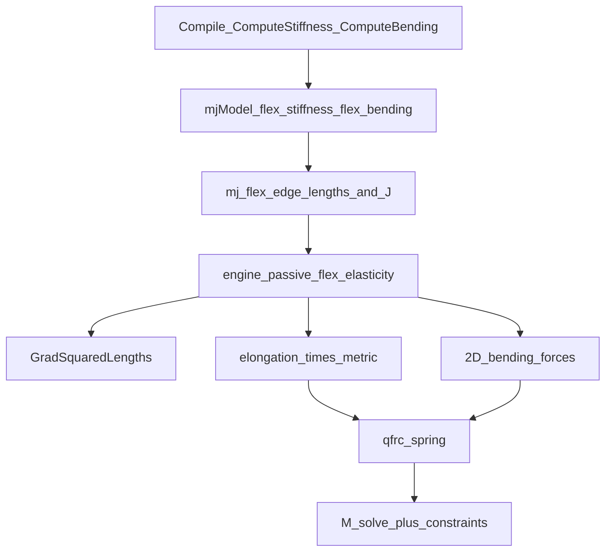

# MuJoCo 二三维 Flex 理论和计算

**本篇范围**：2D/3D flex 的 StVK 连续体模型、编译期刚度预计算、运行时弹性力与 2D 弯曲、源码映射。  
**不涵盖**：1D 边弹簧模型（见 [一维专篇](mujoco一维Flex理论和计算.md)）。  
**前置阅读**：[Flex 总体建模与配置](mujoco Flex 总体建模与配置.md) · **对比**：[一维专篇](mujoco一维Flex理论和计算.md)

---

## 0) 前提与对象语义

- **2D flex**：基本元为 **triangle**（3 顶点）；物理语义接近 **膜/壳**（membrane/shell）。
- **3D flex**：基本元为 **tetrahedron**（4 顶点）；物理语义为 **固体**（solid）。
- 形变主路径：**`flex/elasticity`**（StVK + 分片线性 FEM 等价），**不是** 1D 的 `edge stiffness`。
- 运行时：`engine_passive.c` 的 `flex elasticity` 块对 **`dim==1` 直接跳过**；2D/3D 走本文路径。

dim 路由总表见 [总览 §4.3](mujoco Flex 总体建模与配置.md)。

---

## 1) 材料参数：`flex/elasticity`

| 参数 | 含义 | 单位/范围 |
|------|------|----------|
| `young` | 杨氏模量 $E$ | pressure（force/area） |
| `poisson` | 泊松比 $\nu$ | $[0, 0.5)$ |
| `damping` | Rayleigh 阻尼系数 | 时间；与刚度配合得 $C = \zeta K$ |
| `thickness` | 壳厚度（**仅 2D**） | length；缩放拉伸刚度 |
| `elastic2d` | 2D 弹性模型变体 | 见 XML reference |

### 1.1 StVK 连续体本构

Saint Venant-Kirchhoff 模型：大位移/大转动、**小应变**，非线性应变-位移 + 线性应力-应变。

Green-Lagrange 应变 $\mathbf{E}$，第二 Piola-Kirchhoff 应力：

$$
\mathbf{S} = \lambda \,\mathrm{tr}(\mathbf{E})\mathbf{I} + 2\mu\mathbf{E}
$$

Lamé 参数由 Young/Poisson 决定：

$$
\mu = \frac{E}{2(1+\nu)},\quad
\lambda = \frac{E\nu}{(1+\nu)(1-2\nu)}
$$

官方描述（[doc/XMLreference.rst](../../doc/XMLreference.rst) `flex/elasticity`）：piecewise linear finite elements discretization。

### 1.2 编译期限制

- `edge stiffness > 0` 且 `dim > 1` → 编译报错，提示使用 elasticity 插件（`user_mesh.cc`）。
- `young > 0` 时，编译期对 2D/3D 单元调用 `ComputeStiffness`；**1D 不调用**。

---

## 2) 编译期：刚度度量预计算

实现文件：`src/user/user_mesh.cc`。

### 2.1 流程概览

对每个 2D/3D 单元（编译时参考构型）：

1. 计算单元体积/面积 `ComputeVolume`；
2. 由 Lamé 参数 $\mu,\lambda$（含 2D `thickness` 缩放）得材料刚度系数；
3. 对每条边调用 `ComputeBasis`，得 9×9 局部基（边法向对称张量积）；
4. `MetricTensor` 组装 **21 个独立分量** 存入 `m->flex_stiffness`（每单元 21 浮点数）。

### 2.2 Coordinate-free PL-FEM 等价

`ComputeBasis` 注释（2D 例）：

> equivalent to linear finite elements but in a **coordinate-free formulation**.

参考 Weischedel “A discrete geometric view on shear-deformable shell models”——用边法向对称张量积作基，**不显式构造形函数** $N_i(x)$，但与线性有限元等价。

2D 每单元 3 条边、3 顶点；3D 每单元 6 条边、4 顶点。

### 2.3 材料参数进入刚度

`ComputeStiffness` 中（2D 含 thickness）：

```cpp
double mu = E / (2*(1+nu)) * std::abs(volume) / 4 * thickness;
double la = E*nu / ((1+nu)*(1-2*nu)) * std::abs(volume) / 4 * thickness;
```

3D 固体：`thickness` 不参与（体积即 $\|V\|$）。

### 2.4 2D 弯曲刚度预计算

对内部边（flap 四顶点 $v_0,v_1,v_2,v_3$），`ComputeBending` 预计算 **17×边** 的弯曲矩阵 `m->flex_bending`：

- 基于 Wardetzky 离散二次曲率能量（cotangent 算子）；
- Garg et al. “Cubic Shells” 曲率参考项；
- 边界边（`flap[1]==-1`）跳过。

运行时 2D 弯曲力在 `engine_passive.c` `dim==2` 分支单独累加到 `qfrc_spring` / `qfrc_damper`。

---

## 3) 运行时：弹性力组装

实现：`src/engine/engine_passive.c`，`flex elasticity` 循环（`dim==1` 已 skip）。

### 3.1 边长平方梯度

对每个单元，调用 `GradSquaredLengths`：

$$
\frac{\partial (l_e^2)}{\partial x_v} = 2(x_{v_a}-x_{v_b}) \quad \text{（沿边 } e=(v_a,v_b)\text{）}
$$

实现为顶点对之间的位置差（见 `engine_passive.c` L47–57）。

### 3.2 边伸长量（含 Rayleigh 阻尼修正）

对单元内 $n_e$ 条边（2D: 3，3D: 6），取全局边索引，构造 **伸长量** `elongation[e]`：

- 基于当前边长 `deformed` 与参考 `reference` 的平方差；
- 叠加 Kharevych et al. 离散 Lagrangian 风格的广义 Rayleigh 阻尼项（注释指向 Section 5.2）。

### 3.3 度量张量乘伸长 → 顶点力

预计算 21 分量 unpack 为 $n_e \times n_e$ 对称 `metric`，再：

$$
f_v \mathrel{+}= -\sum_{e_1,e_2} \text{elongation}[e_1] \cdot \text{metric}[e_1,e_2] \cdot \nabla_{x_v}(l_{e_2}^2)
$$

注释说明：若 `metric = diag(1/reference)` 则退化为 **mass-spring 模型**；一般 metric 来自 StVK 预计算，体现剪切/体积耦合。

力累加到单元顶点局部 `qfrc`，再写入 `qfrc_spring`（pinned 顶点经 `mj_applyFT` 分配）。

### 3.4 与 1D 边弹簧的对照

| | 1D edge spring | 2D/3D elasticity |
|---|--------------|------------------|
| 配置变量 | 标量边长 $l_e$ | 边长平方差 + 单元度量 |
| 刚度来源 | `flex_edgestiffness` | `ComputeStiffness` → `flex_stiffness` |
| 运行时块 | flexedge-level spring-dampers | element-by-element metric × gradient |
| dim 条件 | 主路径 | `dim==1` **continue** 跳过 |

---

## 4) 2D 弯曲力（运行时）

`engine_passive.c` 中 `dim==2` 专用循环（在 StVK 块之前）：

- 遍历每条边及其 **flap** 四顶点；
- 用预计算 `flex_bending`（17×边）作 thin plate 弯曲弹簧矩阵；
- 力写入 `qfrc_spring` / `qfrc_damper`（阻尼乘 `flex_damping`）。

需 `young>0` 且内部边（非边界）才有弯曲贡献。

---

## 5) 示例 XML

### 5.1 3D 软体 grid（摘自 doc/modeling.rst）

```xml
<option timestep=".001"/>

<worldbody>
  <flexcomp type="grid" count="24 4 4" spacing=".1 .1 .1" pos=".1 0 1.5"
            radius=".0" rgba="0 .7 .7 1" name="softbody" dim="3" mass="7">
    <contact condim="3" solref="0.01 1" solimp=".95 .99 .0001" selfcollide="none"/>
    <edge damping="1"/>
    <elasticity poisson="0.2" young="5e4"/>
  </flexcomp>
</worldbody>
```

- `young/poisson` 驱动 StVK 拉伸/剪切；
- `edge damping` 在 2D/3D 常与边级阻尼/约束配合（语义见 XML reference）；
- 大 flex 需 `selfcollide` 剪枝 + 小 `timestep`。

### 5.2 2D 要点

- 设 `dim="2"`，`elasticity` 含 `thickness`（常取 `2*radius` 匹配几何）；
- 可选 `elastic2d` 选择 2D 模型变体。

---

## 6) 与插件的边界

### 6.1 内置 `flex/elasticity`（本篇）

- 2D/3D flex 的 **first-party 主路径**；
- 编译期 `ComputeStiffness` + 运行时 metric 组装。

### 6.2 elasticity 插件

| 插件 | 对象 | 用途 |
|------|------|------|
| **cable** | 1D | **不可伸长** 杆，弯扭为主（**非** stretchable 1D flex） |
| Solid / Membrane | 2D/3D | XML reference 提及的 first-party 插件备选；可与 flex 组合 |

插件目录：[plugin/elasticity/](../../plugin/elasticity/)，示例：[model/plugin/elasticity/](../../model/plugin/elasticity/)。

**选型**：

- 可伸长 1D 线体 → [1D flex + edge](mujoco一维Flex理论和计算.md)；
- 不可伸长 1D 杆 → **cable** 插件；
- 2D/3D 连续体 → 优先内置 **`flex/elasticity`**；特殊本构可考察插件。

---

## 7) 完整方程框架（2D/3D）

### 7.1 质量

与 1D 相同：单元 **无质量**，质量在顶点 body（`flexcomp` 均分）。系统 $M(q)$ 仍为刚体多体质量阵。见 [一维专篇 §5.2](mujoco一维Flex理论和计算.md)（1D 与 2D/3D 质量语义一致）。

### 7.2 内力（passive）

$$
\tau_{\text{passive}}^{\text{2D/3D}}
= \sum_{\text{elem } t} \sum_v J_{x_v}^\top f_v^{(t)}(q)
$$

其中 $f_v^{(t)}$ 由 **伸长量 × 预计算 metric × 边长平方梯度** 得（§3.3）；2D 另加弯曲项。

无全局显式 $K$ 矩阵乘法；力 **按单元即时计算**。

### 7.3 约束与接触

- `equality/flex`：边长等式（各 dim 通用）；
- flex 接触：多 body 权重分配（[总览 §5](mujoco Flex 总体建模与配置.md)）。

### 7.4 系统汇总

$$
M(q)\ddot q = \tau_{\text{smooth}} + J^\top\lambda
$$

$\tau_{\text{smooth}}$ 中 `qfrc_passive` 含 2D/3D StVK 弹性 + 2D 弯曲 + 全局 edge spring-damper（若 1D 参数误设则仅 1D 生效）。



---

## 8) 推导来源索引（公式 → 源码）

### 8.1 编译期

| 主题 | 源码 |
|------|------|
| `ComputeBasis`（PL-FEM 等价） | `src/user/user_mesh.cc` L3559–3632 |
| `ComputeStiffness` | `src/user/user_mesh.cc` L3636–3659 |
| `ComputeBending`（2D） | `src/user/user_mesh.cc` L3738+ |
| `edge stiffness` 禁止 dim>1 | `src/user/user_mesh.cc` L4120–4122 |
| 仅 2D/3D 调用 ComputeStiffness | `src/user/user_mesh.cc` L4342–4356 |

### 8.2 运行时

| 主题 | 源码 |
|------|------|
| `dim==1` skip FEM | `src/engine/engine_passive.c` L144–146 |
| `GradSquaredLengths` | `src/engine/engine_passive.c` L47–57 |
| 单元 metric × 伸长 → 力 | `src/engine/engine_passive.c` L315–387 |
| 2D 弯曲力 | `src/engine/engine_passive.c` L148–212 |
| 1D 边弹簧（对照） | `src/engine/engine_passive.c` L392–427 |

### 8.3 官方文档

- StVK / elasticity 参数：[doc/XMLreference.rst](../../doc/XMLreference.rst) `flex/elasticity`
- 3D flex 建模示例：[doc/modeling.rst](../../doc/modeling.rst) Deformable objects
- 系统约束：[doc/computation/index.rst](../../doc/computation/index.rst)

---

## 9) 调参提示（2D/3D）

- `young` 过大需减小 `timestep` 或增大 `damping`。
- 2D：`thickness` 影响面内刚度尺度；弯曲刚度还依赖 $\mu$ 与 `thickness^3`（`ComputeBending`）。
- 大网格务必配置 `selfcollide` 剪枝；接触 `solref`/`solimp` 影响稳定性。
- 3D 四面体网格质量影响刚度预计算；外表细、内部粗较合理（见 modeling.rst Bunny 示例说明）。
