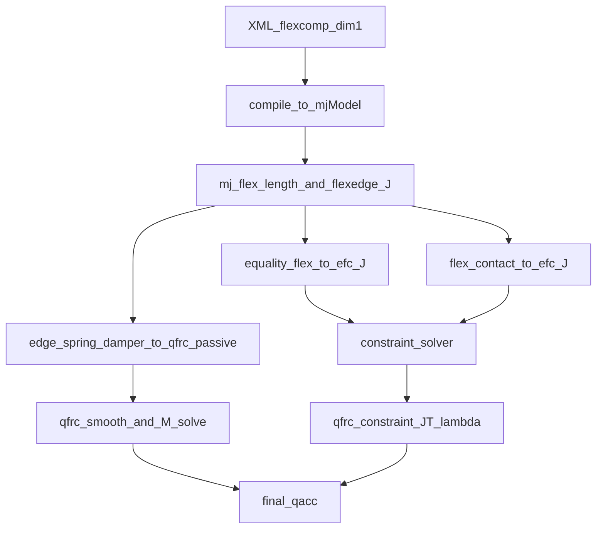

# MuJoCo 一维 Flex 理论和计算

**本篇范围**：1D flex（可伸长柔性线体）的边模型力学、完整方程推导与源码映射。  
**不涵盖**：Flex 统一框架、2D/3D StVK 连续体（见总览与二三维专篇）。  
**前置阅读**：[Flex 总体建模与配置](mujoco Flex 总体建模与配置.md) · **延伸**：[二三维 Flex 理论和计算](mujoco 二三维Flex理论和计算.md)

---

## 0) 实现路径声明

MuJoCo 1D flex **不是**运行时分片线性有限元（FEM）主路径。

- **运行时主通道**：`flex/edge` 边弹簧/阻尼 + 可选 `equality/flex` 边长约束。
- **源码依据**：`engine_passive.c` 中 `flex elasticity` 块对 `dim==1` 直接 `continue`，不进入 StVK 力计算。
- **形变范式总览**：见 [总览 §4](mujoco Flex 总体建模与配置.md)。

1D 元素为 **2 顶点 capsule**，拓扑抽象：

- 顶点集合：$\mathcal{V}=\{v_i\}$
- 边/元素集合：$\mathcal{E}=\{e=(i,j)\}$

---

## 1) 与 cable 的边界

| 对象 | 伸长性 | 主要力学 |
|------|--------|---------|
| **1D flex** | 可伸长 | 边弹簧/阻尼 + 边长约束 |
| **cable** 插件 | 不可伸长 | 弯曲 + 扭转 |

详表见 [总览 §1.3](mujoco Flex 总体建模与配置.md)。  
`rope`/`loop` 已弃用；不可伸长杆用 `cable`，可伸长细线用 1D flex。

---

## 2) 边模型（edge-based）

1D flex 的形变力 **仅** 通过边模型实现（[总览 §4.1](mujoco Flex 总体建模与配置.md)）。

### 2.1 被动力：`flex/edge`

- `stiffness`：边向弹簧刚度（**仅 1D 可用**）。
- `damping`：边向速度阻尼。

单边势能（工程解释）：

$$
U_e \approx \frac{1}{2}k_e(l_e - l_{0,e})^2
$$

标量边力：

$$
f_e = k_e(l_{0,e}-l_e)-c_e\dot l_e
$$

广义力：$\tau^{\text{edge}}_e = J_e^\top f_e$。

### 2.2 约束力：`equality/flex`

- `<edge equality="true"/>` 或显式 `<equality flex="..."/>` 将边长软约束到参考长度 $l_{0,e}$。
- 约束残差 $\phi_e = l_e - l_{0,e}$，Jacobian 行即 $J_e$。
- 通常比纯 edge stiffness 更强，允许更大时间步。

### 2.3 与线性杆单元 / 桁架的关系

MuJoCo 1D flex 在拉伸语义上类似 **非线性几何桁架杆**：

- 经典 1D 杆单元 FEM：$u(x)=N_1 u_1 + N_2 u_2$，$\varepsilon=du/dx$，$f=EA(l-l_0)/L$。
- MuJoCo 直接用 3D 边长 $l_e=\|x_j-x_i\|$ 作标量配置变量，经 $J_e$ 映射到各 body 的 slide DOF。
- **不是** 连续体弱形式 FEM；是 **lumped 边弹簧网络**。

StVK / `young/poisson` 的连续体语义见 [二三维专篇](mujoco 二三维Flex理论和计算.md)。

---

## 3) 1D 建模要点

### 3.1 flexcomp 常用配置

- `type="grid" dim="1"`：1D 点列，相邻点连成 capsule。
- `type="circle" dim="1"`：闭环点列（首尾相连）。
- `pin id="..."`：固定点到父 body。
- `mass`：总质量均分到各非 pinned 点 body。

低层 `deformable/flex` 字段说明见 [总览 §3](mujoco Flex 总体建模与配置.md)。

### 3.2 最小示例

```xml
<mujoco model="flex1d_minimal">
  <worldbody>
    <flexcomp name="line1d"
              type="grid"
              dim="1"
              count="5 1 1"
              spacing="0.10 1 1"
              mass="0.5"
              radius="0.01"
              pos="0 0 1"
              rgba="0.9 0.2 0.2 1">
      <pin id="0"/>
      <edge stiffness="2000" damping="2"/>
      <!-- <edge equality="true"/> -->
      <contact condim="3" selfcollide="none"/>
    </flexcomp>
  </worldbody>
</mujoco>
```

- `count="5 1 1"` + `dim="1"` → 5 点、4 段 capsule。
- `spacing` 第一分量为点距；`radius` 过大易永久接触，需与 `spacing` 协同。
- 闭环：改 `type="circle"`。

官方 1D 示例：[model/flex/pulley.xml](../../model/flex/pulley.xml)（`type="circle"` + `edge equality`）。

---

## 4) 调参建议

- 先固定拓扑（`count/spacing/radius`），再调 `stiffness/damping`。
- 大刚度配小时间步，必要时加阻尼。
- `edge stiffness`（软）与 `equality/flex`（强）勿盲目同时拉满。
- 先 `selfcollide="none"` 确认主行为，再逐步打开自碰撞。

---

## 5) 完整方程推导（质量阵 / 内力 / 外力 / 雅可比）

### 5.1 记号

$$
q \in \mathbb{R}^{n_v},\quad \dot q \in \mathbb{R}^{n_v},\quad \ddot q \in \mathbb{R}^{n_v}
$$

边 $e=(i,j)$ 世界系端点 $x_i(q), x_j(q)$，边向量与长度：

$$
r_e = x_j - x_i,\quad l_e=\|r_e\|,\quad u_e = \frac{r_e}{\|r_e\|}
$$

实现：`mj_flex` 计算 `d->flexedge_length[e]`、`d->flexedge_J`（`src/engine/engine_core_smooth.c`）。

### 5.2 质量阵 $M(q)$

1D flex 元素为 **massless stretchable elements**；质量在顶点 body 上。

$$
M(q)\ddot q + c(q,\dot q) = \tau_{\text{total}}
$$

$M(q)$ 由标准 CRB 路径组装，无独立 flex 元素质量子块。

`flexcomp` 质量分配：

$$
m_{\text{body}} = \frac{m_{\text{flex}}}{N_p}
$$

- `bodymass = mass/npnt`：`src/user/user_flexcomp.cc`
- `qacc_smooth = M \ qfrc_smooth`：`src/engine/engine_forward.c`

### 5.3 内力

#### 5.3.1 边弹簧阻尼

$$
\tau_{\text{edge}} = \sum_{e\in\mathcal{E}} J_e^\top\Big(k_e(l_{0,e}-l_e)-c_e\dot l_e\Big)
$$

累加到 `qfrc_spring`、`qfrc_damper` → `qfrc_passive`。

- `frc_spring = stiffness * (length0 - length)`  
- `frc_damper = -damping * velocity`  
- `qfrc_* += J * frc_*`：`src/engine/engine_passive.c`（flexedge-level spring-dampers）

#### 5.3.2 等式边约束（`mjEQ_FLEX`）

$$
\phi_e(q) = l_e(q)-l_{0,e}=0,\quad J_{\phi,e}=J_e,\quad \tau^{\text{eq}}_e = J_e^\top \lambda_e
$$

- `efc_pos = length - length0`，Jacobian 取 `flexedge_J`：`src/engine/engine_core_constraint.c`
- 约束力 → `qfrc_constraint`：`engine_forward.c` / `engine_solver.c`

### 5.4 外力

1D flex 外力作用在顶点 body 上：

1. **接触**：flex capsule 碰撞，力经约束求解分配。
2. **重力/惯性**：`qfrc_bias`。
3. **用户力**：`xfrc_applied` / `qfrc_applied`。
4. **执行器**：`qfrc_actuator`。

$$
\tau_{\text{smooth}}
= qfrc_{\text{passive}}
- qfrc_{\text{bias}}
+ qfrc_{\text{applied}}
+ qfrc_{\text{actuator}}
+ \text{project}(xfrc_{\text{applied}})
$$

接触 Jacobian 多体加权：`mj_elemBodyWeight`、`mj_contactJacobian`（`engine_core_constraint.c`）。  
接触数据流通用说明见 [总览 §5](mujoco Flex 总体建模与配置.md)。

### 5.5 雅可比：`flexedge_J`

$$
\dot l_e = u_e^\top(J_{x_j}-J_{x_i})\dot q = J_e(q)\dot q
$$

$$
J_e(q)=u_e^\top(J_{x_j}-J_{x_i})\in\mathbb{R}^{1\times n_v}
$$

- `d->flexedge_velocity = d->flexedge_J * d->qvel`：`engine_forward.c`
- `flexedge_J` 构造：`engine_core_smooth.c`（`mj_flex`）

系统 `efc_J` 含：edge equality 行（$J_e$）与 contact 行。

### 5.6 系统级汇总

$$
M(q)\ddot q = \tau_{\text{smooth}} + J^\top\lambda
$$



---

## 6) 推导来源索引（公式 → 源码）

### 6.1 质量阵与参考量

| 公式/量 | 源码 |
|---------|------|
| $m_{\text{body}}=m_{\text{flex}}/N_p$ | `src/user/user_flexcomp.cc` |
| `qacc_smooth = M \ qfrc_smooth` | `src/engine/engine_forward.c` |
| `flexedge_length0` / `flexedge_invweight0` | `src/engine/engine_setconst.c` |

### 6.2 内力

| 公式/量 | 源码 |
|---------|------|
| $f_e = k_e(l_{0,e}-l_e)-c_e\dot l_e$ | `src/engine/engine_passive.c` L392–427 |
| $\phi_e = l_e-l_{0,e}$，`mjEQ_FLEX` | `src/engine/engine_core_constraint.c` |
| `dim==1` 跳过 FEM 弹性块 | `src/engine/engine_passive.c` L144–146 |

### 6.3 外力与雅可比

| 公式/量 | 源码 |
|---------|------|
| `qfrc_smooth` 组合 | `src/engine/engine_forward.c` |
| 接触多体加权 | `engine_core_constraint.c` |
| $\dot l_e = J_e\dot q$ | `engine_forward.c` |
| $J_e=u_e^\top(J_{x_j}-J_{x_i})$ | `engine_core_smooth.c` |

### 6.4 官方文档

- 1D flex 元与接触分配：[doc/modeling.rst](../../doc/modeling.rst)
- `edge stiffness` 仅 1D：[doc/XMLreference.rst](../../doc/XMLreference.rst) `flex/edge/stiffness`
- 系统约束框架：[doc/computation/index.rst](../../doc/computation/index.rst)
