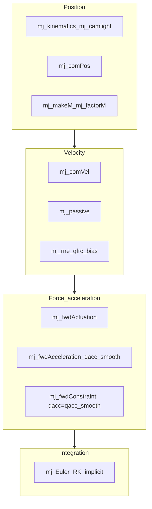
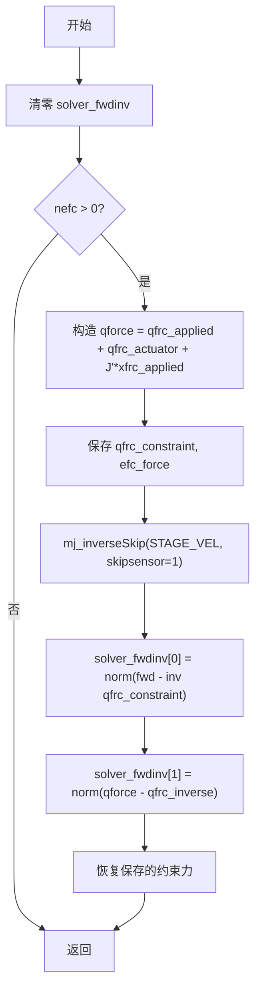

# MuJoCo 程序实现整理

---

## 摘要

介绍mujoco的程序结构和计算流程。

## 1 Mujoco计算流程总览
### 1.1 Simulate.exe 启动
模拟从simulate.exe启动，Main→PhysicsThread→PhysicsLoop

- Main：可视化设置，主线程进行renderloop，单开线程处理物理仿真流程PhysicsThread

- PhysicsThread：loadModel 创建模型 `mjModel`，`mj_makeData` 创建仿真数据 `mjData`，初始化完成后，1. `mj_forward` 更新数据，2. PhysicsLoop 仿真循环

- PhysicsLoop：时间同步机制、确保模拟时间与实际时间匹配，支持暂停、降速控制，调用[mj_step](https://mujoco.readthedocs.io/en/stable/APIreference/APIfunctions.html#mj-step)进行仿真

这里的 `mjModel` 和 `mjData` 是 MuJoCo 仿真中主要涉及的数据结构。`mjModel` 包含模型描述，在运行时保持不变，内容有

- **运动学结构**：身体层次、关节定义、自由度

- **几何数据**：碰撞几何体、视觉元素、惯性属性

- **物理参数**：质量、阻尼系数、约束参数

- **资产数据**：从外部文件加载的网格、纹理、材料

- **仿真选项**：求解器设置、积分参数、功能标志

- **mjData - 动态仿真状态**

`mjData`包含时变动态变量和中间计算结果：

- **状态变量**：位置(`qpos`)、速度(`qvel`)、加速度(`qacc`)

- **控制输入**：执行器控制(`ctrl`)、施加力(`qfrc_applied`,`xfrc_applied`)

- **中间计算量**：接触力、约束雅可比矩阵、惯性矩阵

计算流程的一般形式为：1. 获取必要的 `mjData` 和 `mjModel` 的数据；2. 计算；3. 更新到 `mjData`。

这种模型与数据分离的设计的优点：

- **线程安全**：多个 `mjData` 实例可以并发仿真同一模型
- **状态隔离**：每个仿真维护独立状态
- **内存效率**：静态模型数据在所有仿真间共享
- **清晰易懂**

### 1.2 解析与模型构建
### 1.3 mujoco 库内部计算流程
mujoco的内部计算流程，在官方文档的Computation/Simulation
pipeline下提供了相当清晰的说明。本节内容主要依托该页面的思路，补充了一些细化内容

### 1.4 Forward dynamics
源文件[engine_forward.c](https://github.com/google-deepmind/mujoco/blob/main/src/engine/engine_forward.c) 中包含了high-level
的forward dynamics 流程函数，**其中有**如下几个FD所需的top level
api，他们又分别调用了25个有序的流程函数的一部分或全部，供用户实现特定的仿真流程

- The top-level
  function [mj_step](https://mujoco.readthedocs.io/en/stable/APIreference/APIfunctions.html#mj-step) invokes
  the entire sequence of computations below.

[mj_step](https://mujoco.readthedocs.io/en/stable/APIreference/APIfunctions.html#mj-step) ：调用全部25个流程

- [mj_forward](https://mujoco.readthedocs.io/en/stable/APIreference/APIfunctions.html#mj-forward) invokes
  only stages **2-22**, computing the continuous-time forward dynamics,
  ending with the acceleration `mjData.qacc`.

[mj_forward](https://mujoco.readthedocs.io/en/stable/APIreference/APIfunctions.html#mj-forward) ：调用2-22，

- [mj_step1](https://mujoco.readthedocs.io/en/stable/APIreference/APIfunctions.html#mj-step1) invokes
  stages **1-18** and [mj_step2](https://mujoco.readthedocs.io/en/stable/APIreference/APIfunctions.html#mj-step2) invokes
  stages **19-25**,
  breaking [mj_step](https://mujoco.readthedocs.io/en/stable/APIreference/APIfunctions.html#mj-step) into
  two distinct phases. This allows the user to write controllers that
  depend on quantities derived from the positions and velocities (but
  not forces, since those have not yet been computed). Note that
  the [mj_step1](https://mujoco.readthedocs.io/en/stable/APIreference/APIfunctions.html#mj-step1) → [mj_step2](https://mujoco.readthedocs.io/en/stable/APIreference/APIfunctions.html#mj-step2) pipeline
  does not support the Runge Kutta integrator.

[mj_step1](https://mujoco.readthedocs.io/en/stable/APIreference/APIfunctions.html#mj-step1) 调用 **1-18；** [mj_step2](https://mujoco.readthedocs.io/en/stable/APIreference/APIfunctions.html#mj-step2)调用stages **19-25**

- [mj_fwdPosition](https://mujoco.readthedocs.io/en/stable/APIreference/APIfunctions.html#mj-fwdposition) invokes
  stages **2-11**, the position-dependent part of the pipeline.

[mj_fwdPosition](https://mujoco.readthedocs.io/en/stable/APIreference/APIfunctions.html#mj-fwdposition) 调用stages **2-11**

**除了官网文档描述的这些，其实还有mj_fwdVelocity；mj_fwdActuation；mj_fwdAcceleration；mj_fwdConstraint和其他一些实现integrator或check的API，似乎也可能被用户使用。**

**以上**几种FD api**调用的25个有序Stages**

#### Stage 1: Check the positions and velocities for invalid or unacceptably large real values indicating divergence. If divergence is detected, the state is automatically reset and the corresponding warning is raised: [mj_checkPos](https://mujoco.readthedocs.io/en/stable/APIreference/APIfunctions.html#mj-checkpos), [mj_checkVel](https://mujoco.readthedocs.io/en/stable/APIreference/APIfunctions.html#mj-checkvel)

#### Position

The stages below compute quantities that depend on the generalized
positions `mjData.qpos`.

#### Stage 2: Compute the forward kinematics. This yields the global positions and orientations of all bodies, geoms, sites, cameras and lights. It also normalizes all quaternions: [mj_kinematics](https://mujoco.readthedocs.io/en/stable/APIreference/APIfunctions.html#mj-kinematics), [mj_camlight](https://mujoco.readthedocs.io/en/stable/APIreference/APIfunctions.html#mj-camlight)

- mj_kinematics，正向传递，计算body
  frame的位置姿态，及惯性轴姿态，d→xpos、xquat、xipos、xmat、ximat

- 直接遍历，无递归，m和d中的数据都是递归编号过的

- 分铰类型计算：？

> (X,A)=F(q,qd,qdd)

#### Stage 3: Compute the body inertias and joint axes, in global frames centered at the centers of mass of the corresponding kinematic subtrees: [mj_comPos](https://mujoco.readthedocs.io/en/stable/APIreference/APIfunctions.html#mj-compos)

- 逆向传递，计算子树质心、子树惯性（子树质量和相对子树质心的惯性张量）

后续用于质量阵计算

#### Stage 4: Compute quantities related to [flex](https://mujoco.readthedocs.io/en/stable/XMLreference.html#deformable-flex) objects: [mj_flex](https://mujoco.readthedocs.io/en/stable/APIreference/APIfunctions.html#mj-flex)

#### Stage 5: Compute the tendon lengths and moment arms. This includes the computation of minimal-length paths for spatial tendons: [mj_tendon](https://mujoco.readthedocs.io/en/stable/APIreference/APIfunctions.html#mj-tendon)

#### Stage 6: Compute the composite rigid body inertias and joint-space inertia matrix: [mj_makeM](https://mujoco.readthedocs.io/en/stable/APIreference/APIfunctions.html#mj-makem)

- 分3个函数流程：mj_crb，composite rigid
  body惯性计算；mj_tendonArmature，计算tendon的惯性；
  mju_scatter，从M（reduced inertia）生成qM（inertia）

mj_crb 内的composite rigid body算法

#### Stage 7: Compute the sparse factorization of the joint-space inertia matrix: [mj_factorM](https://mujoco.readthedocs.io/en/stable/APIreference/APIfunctions.html#mj-factorm)

#### Stage 8: Construct the list of active contacts. This includes both broad-phase and near-phase collision detection: [mj_collision](https://mujoco.readthedocs.io/en/stable/APIreference/APIfunctions.html#mj-collision)

#### Stage 9: Construct the constraint Jacobian and compute the constraint residuals: [mj_makeConstraint](https://mujoco.readthedocs.io/en/stable/APIreference/APIfunctions.html#mj-makeconstraint)

#### Stage 10: Compute the actuator lengths and moment arms: [mj_transmission](https://mujoco.readthedocs.io/en/stable/APIreference/APIfunctions.html#mj-transmission)

#### Stage 11: Compute the matrices and vectors needed by the constraint solvers: [mj_projectConstraint](https://mujoco.readthedocs.io/en/stable/APIreference/APIfunctions.html#mj-projectconstraint)

#### Stage 12: Compute sensor data that only depends on position, and the potential energy if enabled: [mj_sensorPos](https://mujoco.readthedocs.io/en/stable/APIreference/APIfunctions.html#mj-sensorpos), [mj_energyPos](https://mujoco.readthedocs.io/en/stable/APIreference/APIfunctions.html#mj-energypos)

#### Velocity

The stages below compute quantities that depend on the generalized
velocity `mjData.qvel`. Due to the sequential dependence structure of the
pipeline, the actual dependence is on both qpos and qvel.

#### Stage 13: Compute the tendon, flex edge and actuator velocities: [mj_fwdVelocity](https://mujoco.readthedocs.io/en/stable/APIreference/APIfunctions.html#mj-fwdvelocity)

#### Stage 14: Compute the body velocities and rates of change of the joint axes, again in the global coordinate frames centered at the subtree centers of mass: [mj_comVel](https://mujoco.readthedocs.io/en/stable/APIreference/APIfunctions.html#mj-comvel)

#### Stage 15: Compute passive forces – spring-dampers in joints and tendons, and fluid forces: [mj_passive](https://mujoco.readthedocs.io/en/stable/APIreference/APIfunctions.html#mj-passive)

- 弹簧阻尼力，mj_springdamper

- 重力补偿力，mj_gravcomp

- 流体力，mj_fluid

- 用户自定义被动力，mjcb_passive

- 插件定义被动力

#### Stage 16: Compute sensor data that depends on velocity, and the kinetic energy if enabled (if required by sensors, call [mj_subtreeVel](https://mujoco.readthedocs.io/en/stable/APIreference/APIfunctions.html#mj-subtreevel)): [mj_sensorVel](https://mujoco.readthedocs.io/en/stable/APIreference/APIfunctions.html#mj-sensorvel)

#### Stage 17: Compute the reference constraint acceleration: [mj_referenceConstraint](https://mujoco.readthedocs.io/en/stable/APIreference/APIfunctions.html#mj-referenceconstraint)

- 计算约束相关数组：`efc_vel`（约束空间速度）和`efc_aref`（参考伪加速度）。

#### Stage 18: Compute the vector of Coriolis, centrifugal and gravitational forces: [mj_rne](https://mujoco.readthedocs.io/en/stable/APIreference/APIfunctions.html#mj-rne)

- RNE(Recursive Newton-Eulor algorithm)是逆向动力学的核心流程，

$$
\mathbf{\tau} = ID(model,\mathbf{q},\dot{\mathbf{q}},\ddot{\mathbf{q}},\mathbf{f}^{x})
$$

给定系统状态和外力$(model,\mathbf{q},\dot{\mathbf{q}},\ddot{\mathbf{q}},\mathbf{f}^{x})$，从根开始逐步计算每个体的位置、速度、加速度，

$$
\mathbf{v}_{i} = \mathbf{v}_{\lambda(i)} + \mathbf{S}_{i}{\dot{\mathbf{q}}}_{i}
$$

$$
a_{i} = a_{\lambda(i)} + S_{i}{\ddot{q}}_{i} + {\dot{S}}_{i}{\dot{q}}_{i}
$$

从叶开始逐步反向计算铰空间广义力。

$$
f_{i} = f_{i}^{B} - f_{i}^{x} + \sum_{j \in \mu(i)} f_{j}
$$

$$
\tau_{i} = S_{i}^{T}f_{i}
$$

- RNE计算C，

$$
\tau = \mathbf{H}(\mathbf{q})\ddot{\mathbf{q}} + \mathbf{C}(\mathbf{q},\dot{\mathbf{q}},\mathbf{f}^{x})
$$

$$
\mathbf{C} = ID(model,\mathbf{q},\dot{\mathbf{q}},\mathbf{0},\mathbf{f}^{x})
$$

**1. 初始化阶段**

函数首先分配临时存储空间并初始化世界坐标系的加速度：

- 分配`loc_cacc`（物体加速度）和`loc_cfrc_body`（物体力）的存储空间

- 将世界坐标系的加速度设置为负重力加速度（如果重力未被禁用） 

**2. 前向传递（Forward Pass）**

对所有物体进行前向遍历，计算每个物体的加速度和作用力：

**步骤2.1：计算物体加速度**

- `cacc = cacc_parent + cdofdot * qvel`：将父物体的加速度加上由关节速度引起的加速度项（`engine_core_smooth.c` 2107–2109 行）

**步骤2.2：添加关节加速度项（如果启用）**

- 当 `flg_acc=1` 时，添加 `cdof * qacc` 项到物体加速度中

**步骤2.3：计算物体受力**

- `cfrc_body = cinert * cacc + cvel × (cinert * cvel)`：计算惯性力和科里奥利力/离心力

- 使用`mju_mulInertVec`计算惯性矩阵与加速度的乘积

- 使用`mju_crossForce`计算速度相关的交叉乘积项

**3. 后向传递（Backward Pass）**

从叶节点向根节点反向传递，将子物体的力传递给父物体：

- 对每个物体，将其受力累加到其父物体上 

**4. 结果计算**

最终计算关节空间的广义力：

- `result[i] = cdof * cfrc_body`：将物体受力通过关节雅可比矩阵投影到关节空间

#### Force/acceleration

The stages below compute quantities that depend on [user
inputs](https://mujoco.readthedocs.io/en/stable/computation/#geinput).
Due to the sequential nature of the pipeline, the actual dependence is
on the entire [integration
state](https://mujoco.readthedocs.io/en/stable/computation/#geintegrationstate).

#### Stage 19: Compute the actuator forces and activation dynamics if defined: [mj_fwdActuation](https://mujoco.readthedocs.io/en/stable/APIreference/APIfunctions.html#mj-fwdactuation)

#### Stage 20: Compute the joint acceleration resulting from all forces except for the (still unknown) constraint forces: [mj_fwdAcceleration](https://mujoco.readthedocs.io/en/stable/APIreference/APIfunctions.html#mj-fwdacceleration)

#### Stage 21: Compute the constraint forces with the selected solver, and update the joint acceleration so as to account for the constraint forces. This yields the vector `mjData.qacc` which is the main output of forward dynamics: [mj_fwdConstraint](https://mujoco.readthedocs.io/en/stable/APIreference/APIfunctions.html#mj-fwdconstraint)

约束求解：

1 warmstart，约束求解初始化操作，决定预估值

2 第一步迭代，update，计算hessian，计算grad

#### Stage 22: Compute sensor data that depends on force and acceleration if enabled (if required by sensors, call [mj_rnePostConstraint](https://mujoco.readthedocs.io/en/stable/APIreference/APIfunctions.html#mj-rnepostconstraint)): [mj_sensorAcc](https://mujoco.readthedocs.io/en/stable/APIreference/APIfunctions.html#mj-sensoracc)

#### Stage 23: Check the acceleration for invalid or unacceptably large real values. If divergence is detected, the state is automatically reset and the corresponding warning is raised: [mj_checkAcc](https://mujoco.readthedocs.io/en/stable/APIreference/APIfunctions.html#mj-checkacc)

#### Stage 24: Compare the results of forward and inverse dynamics, so as to diagnose poor solver convergence in the forward dynamics. This is an optional step, and is performed only when enabled: [mj_compareFwdInv](https://mujoco.readthedocs.io/en/stable/APIreference/APIfunctions.html#mj-comparefwdinv)（正向动力学完成后、积分器之前调用；实现细节见 §2.9）

#### Stage 25: Advance the simulation state by one time step, using the selected integrator. Note that the Runge-Kutta integrator repeats the above sequence three more times, except for the optional computations which are performed only once: one of [mj_Euler](https://mujoco.readthedocs.io/en/stable/APIreference/APIfunctions.html#mj-euler), [mj_RungeKutta](https://mujoco.readthedocs.io/en/stable/APIreference/APIfunctions.html#mj-rungekutta), [mj_implicit](https://mujoco.readthedocs.io/en/stable/APIreference/APIfunctions.html#mj-implicit)

### 1.5 无约束铰接体系统正向动力学（不考虑约束或接触的流程，不考虑flex的流程）

本节聚焦**无碰撞、无约束、无柔性体**的铰接刚体树正向动力学，帮助从完整 §1.4 管线中剥离核心路径。适用场景：模型无碰撞几何/接触、无等式/摩擦等约束（`d->nefc == 0`），仅保留铰接刚体树，以及可选的被动力、执行器与外力。

本节**跳过**的 Stage：4–5（flex/tendon 位置）、8–11（碰撞/约束/传动）、17（约束参考加速度）、21（约束迭代求解）。主输出仍为 `mjData.qacc`，经积分器推进 `qpos`/`qvel`。

连续时间核心方程（[`mj_fwdAcceleration`](src/engine/engine_forward.c)）：

$$
M\ddot{q} = \underbrace{-\mathbf{c}}_{\texttt{qfrc\_bias}} + \underbrace{\mathbf{f}_p}_{\texttt{qfrc\_passive}} + \underbrace{\mathbf{f}_a}_{\texttt{qfrc\_applied}} + \underbrace{\boldsymbol{\tau}_{act}}_{\texttt{qfrc\_actuator}} + \text{project}(\mathbf{f}^x)
$$

无约束时 [`mj_fwdConstraint`](src/engine/engine_forward.c) 直接令 `qacc = qacc_smooth`、`qfrc_constraint = 0`（889–894 行），无需 CG/Newton 迭代。

**推荐 API**：在零约束模型上可直接调用 [`mj_forward`](https://mujoco.readthedocs.io/en/stable/APIreference/APIfunctions.html#mj-forward) / [`mj_step`](https://mujoco.readthedocs.io/en/stable/APIreference/APIfunctions.html#mj-step)；若手写管线，等价于 `mj_fwdKinematics` → `mj_makeM`/`mj_factorM` → `mj_fwdVelocity`（纯铰接树可裁剪 tendon/flex 部分）→ `mj_fwdActuation` → `mj_fwdAcceleration` → 积分器。



#### Position

The stages below compute quantities that depend on the generalized positions `mjData.qpos`（在 [`mj_fwdKinematics`](src/engine/engine_forward.c) 与 [`mj_fwdPosition`](src/engine/engine_forward.c) 中完成）。

#### Stage 2: Compute the forward kinematics.: [mj_kinematics](https://mujoco.readthedocs.io/en/stable/APIreference/APIfunctions.html#mj-kinematics), [mj_camlight](https://mujoco.readthedocs.io/en/stable/APIreference/APIfunctions.html#mj-camlight)（同 FD Stage 2）

- `mj_kinematics`：正向传递，更新 `xpos`、`xquat`、`xipos`、`xmat`、`ximat` 等
- `mj_camlight`：更新相机与灯光位姿
- 算法细节见 §1.4 Stage 2

#### Stage 3: Compute the body inertias and joint axes.: [mj_comPos](https://mujoco.readthedocs.io/en/stable/APIreference/APIfunctions.html#mj-compos)（同 FD Stage 3）

- 在 `mj_fwdKinematics` 内、`mj_kinematics` 之后调用（非独立 top-level 调用顺序）
- 逆向传递，计算子树质心、子树惯性；为 `mj_makeM` 准备
- 算法细节见 §1.4 Stage 3

#### Stage 6: Compute the composite rigid body inertias and joint-space inertia matrix.: [mj_makeM](https://mujoco.readthedocs.io/en/stable/APIreference/APIfunctions.html#mj-makem)（同 FD Stage 6）

- 在 `mj_fwdPosition` 内、`mj_fwdKinematics` 之后调用
- CRB 算法组装关节空间质量阵 `M`（`qM`）
- 算法细节见 §1.4 Stage 6

#### Stage 7: Compute the sparse factorization of the joint-space inertia matrix.: [mj_factorM](https://mujoco.readthedocs.io/en/stable/APIreference/APIfunctions.html#mj-factorm)（同 FD Stage 7）

- 对 `M` 做 $L^T D L$ 稀疏分解，供后续 `mj_solveM` / `mj_solveLD` 使用
- 算法细节见 §1.4 Stage 7

#### Velocity

The stages below compute quantities that depend on the generalized velocity `mjData.qvel`（主要在 [`mj_fwdVelocity`](src/engine/engine_forward.c) 中完成）。

#### Stage 13（可选）: Compute the tendon, flex edge and actuator velocities.: [mj_fwdVelocity](https://mujoco.readthedocs.io/en/stable/APIreference/APIfunctions.html#mj-fwdvelocity)（同 FD Stage 13）

- 若模型含肌腱/执行器，`mj_fwdVelocity` 前半段计算 tendon/actuator 速度
- 纯铰接刚体树、无肌腱/执行器时可忽略

#### Stage 14: Compute the body velocities and rates of change of the joint axes.: [mj_comVel](https://mujoco.readthedocs.io/en/stable/APIreference/APIfunctions.html#mj-comvel)（同 FD Stage 14）

- 在 `mj_fwdVelocity` 内调用；计算子树质心坐标系下的体速度与关节轴变化率
- 算法细节见 §1.4 Stage 14

#### Stage 15: Compute passive forces.: [mj_passive](https://mujoco.readthedocs.io/en/stable/APIreference/APIfunctions.html#mj-passive)（同 FD Stage 15）

- 在 `mj_fwdVelocity` 内调用；关节/肌腱弹簧阻尼、重力补偿、流体等
- 结果写入 `qfrc_passive`
- 算法细节见 §1.4 Stage 15

#### Stage 18: Compute the vector of Coriolis, centrifugal and gravitational forces.: [mj_rne](https://mujoco.readthedocs.io/en/stable/APIreference/APIfunctions.html#mj-rne)（同 FD Stage 18）

- 在 `mj_fwdVelocity` 末尾调用：`mj_rne(m, d, 0, qfrc_bias)`，`flg_acc=0`，只求 bias 力（科氏/离心/重力），不含 $M\ddot{q}$ 项
- 若有肌腱，`mj_tendonBias` 叠加到 `qfrc_bias`
- RNE 算法详解见 §1.4 Stage 18

**跳过**：Stage 17 `mj_referenceConstraint`（无约束时 `nefc=0`，无实际作用）。

#### Force/acceleration

The stages below compute quantities that depend on user inputs; 无约束情形下主输出为 `qacc`。

#### Stage 19: Compute the actuator forces and activation dynamics if defined.: [mj_fwdActuation](https://mujoco.readthedocs.io/en/stable/APIreference/APIfunctions.html#mj-fwdactuation)（同 FD Stage 19）

- 计算执行器力与激活动力学，结果写入 `qfrc_actuator`
- 无执行器时可跳过

#### Stage 20: Compute the joint acceleration resulting from all forces except constraint forces.: [mj_fwdAcceleration](https://mujoco.readthedocs.io/en/stable/APIreference/APIfunctions.html#mj-fwdacceleration)（同 FD Stage 20）

- 组装平滑广义力：

$$
\texttt{qfrc\_smooth} = \texttt{qfrc\_passive} - \texttt{qfrc\_bias} + \texttt{qfrc\_applied} + \texttt{qfrc\_actuator}
$$

- `mj_xfrcAccumulate` 将体坐标外力 `xfrc_applied` 投影累加到 `qfrc_smooth`
- 求解无约束加速度：`qacc_smooth = M \ qfrc_smooth`（`mj_solveLD`，见 `engine_forward.c` 756–783 行）

#### Stage 21（无约束等价）: Constraint-free acceleration.: [mj_fwdConstraint](https://mujoco.readthedocs.io/en/stable/APIreference/APIfunctions.html#mj-fwdconstraint)

- 当 `nefc == 0` 时，`mj_fwdConstraint` 直接 `qacc = qacc_smooth`，`qfrc_constraint = 0`，不进入迭代求解
- 与 §1.6 ID 中「已知 $\ddot{q}$ 解析求力」形成对照：FD 侧由力求加速度，ID 侧由加速度求力

#### Integration

#### Stage 25: Advance the simulation state by one time step.: [mj_Euler](https://mujoco.readthedocs.io/en/stable/APIreference/APIfunctions.html#mj-euler), [mj_RungeKutta](https://mujoco.readthedocs.io/en/stable/APIreference/APIfunctions.html#mj-rungekutta), [mj_implicit](https://mujoco.readthedocs.io/en/stable/APIreference/APIfunctions.html#mj-implicit)（同 FD Stage 25）

- 用 `qacc` 推进 `qpos`/`qvel`（`mj_advance`）
- **Euler**：无阻尼时显式 $v \leftarrow v + h\dot{v}$；有 dof 阻尼时隐式解 $(M + hB)\dot{v} = M\dot{v}_d$（`mj_EulerSkip`，`engine_forward.c` 1108–1181 行）
- **RK4**：除可选计算外，重复 position/velocity 子流程三次
- **Implicit**：全隐式速度积分（`mj_implicit`）

**与 §1.6 逆动力学互逆**：给定同一 $(q,\dot{q},\ddot{q})$，无约束时 ID 的 `qfrc_inverse` 应等于使该加速度成立的外力与执行器力之和；数据流主路径为 `qacc` → 积分器 → 下一时刻 `qpos`/`qvel`。

### 1.6 Inverse dynamics

源文件 [engine_inverse.c](https://github.com/google-deepmind/mujoco/blob/main/src/engine/engine_inverse.c) 包含 high-level 的 inverse dynamics 流程。逆动力学在已知 $(q,\dot{q},\ddot{q})$ 时，求使该加速度成立的广义外力，主输出为 `mjData.qfrc_inverse`（等于外力与执行器力之和）。

**调用前须设置** `mjData.qacc`。与正向动力学互逆：连续时间下 $\tau = M\dot{v} + c - J^T f$（见 [computation](https://mujoco.readthedocs.io/en/stable/computation/#piInverse)）。

Top-level API：

- [`mj_inverse`](https://mujoco.readthedocs.io/en/stable/APIreference/APIfunctions.html#mj-inverse)：调用完整逆动力学流程，等价于 `mj_inverseSkip(m, d, mjSTAGE_NONE, 0)`
- [`mj_inverseSkip`](https://mujoco.readthedocs.io/en/stable/APIreference/APIfunctions.html#mj-inverseskip)：`skipstage` 可跳过已计算的 position/velocity 阶段；`skipsensor` 控制是否重算传感器
- [`mj_compareFwdInv`](https://mujoco.readthedocs.io/en/stable/APIreference/APIfunctions.html#mj-comparefwdinv)：在**已完成正向动力学**（通常刚执行过 `mj_forward` / `mj_step`）的前提下，复用已有 position/velocity 中间量，内部调用 `mj_inverseSkip(m, d, mjSTAGE_VEL, 1)`——即**跳过** ID Stage 1–14（`mj_invPosition`、`mj_invVelocity` 及传感器/能量），仅重算加速度相关部分（`mj_discreteAcc`（可选）→ `mj_invConstraint` → RNE 组装 → `qfrc_inverse`）；`skipsensor=1` 不重算传感器。比较结果写入 `solver_fwdinv[0/1]`，并在比较前后保存/恢复正向的 `qfrc_constraint`、`efc_force`。启用 `mjENBL_FWDINV` 时于正向动力学完成后、积分器之前由 `mj_step`/`mj_step2` 自动调用（FD Stage 24）。实现细节见 §2.9。

与正向动力学的主要差异：无 `mj_fwdActuation` / `mj_fwdAcceleration` / 积分器；约束力由 `mj_invConstraint` **解析**求取（非 §2.3 的 CG/Newton 迭代）；`mj_invVelocity` 直接复用 `mj_fwdVelocity`。

以下 19 个有序 Stage 与官方 [Simulation pipeline — Inverse dynamics](https://mujoco.readthedocs.io/en/stable/computation/#piInverse) 一致；关于 [consistency](https://mujoco.readthedocs.io/en/stable/computation/#piconsistency) 与 [reproducibility](https://mujoco.readthedocs.io/en/stable/computation/#pireproducibility) 的说明同样适用。

#### Position

The stages below compute quantities that depend on the generalized positions `mjData.qpos`（主要在 `mj_invPosition` 内完成，与 FD Stage 2–11 大量共用）。注意：官方 ID 管线无 FD Stage 1（divergence check），故 **ID Stage 编号与 FD 不完全对齐**（例如 ID Stage 1 对应 FD Stage 2）。

#### Stage 1: Compute the forward kinematics.: [mj_kinematics](https://mujoco.readthedocs.io/en/stable/APIreference/APIfunctions.html#mj-kinematics), [mj_camlight](https://mujoco.readthedocs.io/en/stable/APIreference/APIfunctions.html#mj-camlight)（同 FD Stage 2）

- `mj_kinematics`：在 `mj_invPosition` 内首先调用；正向传递，计算 `xpos`、`xquat`、`xipos`、`xmat`、`ximat` 等
- `mj_camlight`：更新相机与灯光位姿

#### Stage 2: Compute the body inertias and joint axes.: [mj_comPos](https://mujoco.readthedocs.io/en/stable/APIreference/APIfunctions.html#mj-compos)（同 FD Stage 3）

- 逆向传递，计算子树质心、子树惯性；为 `mj_makeM` 准备

#### Stage 3: Compute the tendon lengths and moment arms.: [mj_tendon](https://mujoco.readthedocs.io/en/stable/APIreference/APIfunctions.html#mj-tendon)（同 FD Stage 5）

- 计算肌腱长度与力臂；`mj_invPosition` 中在 `mj_flex` 之后调用

#### Stage 4: Compute the actuator lengths and moment arms.: [mj_transmission](https://mujoco.readthedocs.io/en/stable/APIreference/APIfunctions.html#mj-transmission)（同 FD Stage 10）

- 计算执行器传动比与长度；在 `mj_invPosition` 末尾、`mj_makeConstraint` 之后调用

#### Stage 5: Compute the composite rigid body inertias and form the joint-space inertia matrix.: [mj_makeM](https://mujoco.readthedocs.io/en/stable/APIreference/APIfunctions.html#mj-makem)（同 FD Stage 6）

- CRB 算法组装关节空间质量阵 `M`（`qM`）

#### Stage 6: Compute the sparse factorization of the joint-space inertia matrix.: [mj_factorM](https://mujoco.readthedocs.io/en/stable/APIreference/APIfunctions.html#mj-factorm)（同 FD Stage 7）

- 对 `M` 做 $L^T D L$ 稀疏分解，供后续 `mj_mulM` / `mj_solveM` 使用

#### Stage 7: Construct the list of active contacts.: [mj_collision](https://mujoco.readthedocs.io/en/stable/APIreference/APIfunctions.html#mj-collision)（同 FD Stage 8）

- 宽相/窄相碰撞检测，生成活动接触列表

#### Stage 8: Construct the constraint Jacobian and compute the constraint residuals.: [mj_makeConstraint](https://mujoco.readthedocs.io/en/stable/APIreference/APIfunctions.html#mj-makeconstraint)（同 FD Stage 9）

- 构建约束 Jacobian `efc_J` 与位置残差 `efc_pos`
- 若启用 `mjENBL_DIAGEXACT`，随后调用 `mj_projectConstraint`（FD Stage 11 在正向流程中总是执行，逆动力学仅在 DIAGEXACT 时执行）

#### Stage 9: Compute sensor data that only depends on position, and the potential energy if enabled.: [mj_sensorPos](https://mujoco.readthedocs.io/en/stable/APIreference/APIfunctions.html#mj-sensorpos), [mj_energyPos](https://mujoco.readthedocs.io/en/stable/APIreference/APIfunctions.html#mj-energypos)（同 FD Stage 12）

- 在 `mj_inverseSkip` 中、`mj_invPosition` 之后调用
- `mj_energyPos` 仅在 `mjENBL_ENERGY` 开启且尚未计算时执行

#### Velocity

The stages below compute quantities that depend on the generalized velocity `mjData.qvel`（通过 `mj_invVelocity` → `mj_fwdVelocity` 完成，与 FD Stage 13–17 共用）。

#### Stage 10: Compute the tendon and actuator velocities.: [mj_fwdVelocity](https://mujoco.readthedocs.io/en/stable/APIreference/APIfunctions.html#mj-fwdvelocity)（同 FD Stage 13）

- `mj_invVelocity` 内部调用 `mj_fwdVelocity` 的前半段：flex edge / tendon / actuator 速度

#### Stage 11: Compute the body velocities and joint axes rates of change.: [mj_comVel](https://mujoco.readthedocs.io/en/stable/APIreference/APIfunctions.html#mj-comvel)（同 FD Stage 14）

- 在 `mj_fwdVelocity` 内调用；计算体速度与关节轴变化率

#### Stage 12: Compute sensor data that depends on velocity, and the kinetic energy if enabled. If required by sensors, call [mj_subtreeVel](https://mujoco.readthedocs.io/en/stable/APIreference/APIfunctions.html#mj-subtreevel).: [mj_sensorVel](https://mujoco.readthedocs.io/en/stable/APIreference/APIfunctions.html#mj-sensorvel), [mj_energyVel](https://mujoco.readthedocs.io/en/stable/APIreference/APIfunctions.html#mj-energyvel)（同 FD Stage 16）

- 在 `mj_inverseSkip` 中、`mj_invVelocity` 之后调用
- 部分传感器需要时懒求值 `mj_subtreeVel`

#### Stage 13: Compute all passive forces.: [mj_passive](https://mujoco.readthedocs.io/en/stable/APIreference/APIfunctions.html#mj-passive)（同 FD Stage 15）

- 在 `mj_fwdVelocity` 内调用；关节/肌腱弹簧阻尼、重力补偿、流体等；结果写入 `qfrc_passive`

#### Stage 14: Compute the reference constraint acceleration.: [mj_referenceConstraint](https://mujoco.readthedocs.io/en/stable/APIreference/APIfunctions.html#mj-referenceconstraint)（同 FD Stage 17）

- 在 `mj_fwdVelocity` 内调用；计算 `efc_vel`、`efc_aref`

#### Acceleration

The stages below depend on `mjData.qacc` and user inputs; ID 独有组装逻辑在 `mj_inverseSkip` 后半段。

#### Stage 15: If the [invdiscrete](https://mujoco.readthedocs.io/en/stable/XMLreference.html#option-flag-invdiscrete) flag is set and the [integrator](https://mujoco.readthedocs.io/en/stable/XMLreference.html#option-integrator) is not RK4, convert input accelerations from discrete to continuous time.（ID 独有）

- **`invdiscrete` 参数**（`mjENBL_INVDISCRETE`，XML `<flag invdiscrete="enable"/>`）：声明调用 `mj_inverse` 时，输入加速度 **`mjData.qacc`**（代码 `d->qacc`，须事先写入）应按**离散时间**理解——通常即 $(v_{t+h}-v_t)/h$，而非连续时间广义加速度 $\ddot{q}$
- **与正向的关系**：一步积分器（Euler / implicit / implicitfast）正向会把有效动力学写成含 $M-hD$（或 $M-h\,\partial(\cdot)/\partial\dot{v}$）的形式；若把差分速度赋给 `d->qacc` 却不开启此 flag，`mj_inverse` 仍按连续 $\ddot{q}$ 解释，FD/ID 会对不上
- **`mj_discreteAcc` 如何处理 `d->qacc`**：在 `mj_inverseSkip` 内保存 `d->qacc` → 原地转换为连续等效加速度供后续 ID 使用 → 计算结束后恢复用户原始值（外部看到的 `d->qacc` 不变）
- **副作用**：同时关闭自由刚体的 midpoint integration（见 [官方说明](https://mujoco.readthedocs.io/en/stable/XMLreference.html#option-flag-invdiscrete)）
- 内部函数 `mj_discreteAcc`（`engine_inverse.c`）；仅当 `mjENBL_INVDISCRETE` 开启时执行
- 将用户写入 `d->qacc` 的离散时间加速度转为连续时间等效加速度（原地修改 `d->qacc`，结束后恢复）
- **Euler**：若有 dof 阻尼，解 $(M + h\,\mathrm{diag}(B))\dot{v} = M\dot{v}_d$ 得连续 $\dot{v}$
- **Implicit / ImplicitFast**：用 $M - h\,\partial(M\dot{v}+c)/\partial\dot{v}$ 修正后 `mj_solveM` 反解
- **RK4** 不支持离散逆动力学

#### Stage 16: Compute the constraint force. This is done analytically, without using a numerical solver.: [mj_invConstraint](https://mujoco.readthedocs.io/en/stable/APIreference/APIfunctions.html#mj-invconstraint)（ID独有，对比 FD Stage 21）

- `jar = J\dot{v} - a_{ref}`（`efc_aref`），再调用 `mj_constraintUpdate` 解析更新 `efc_force` → `qfrc_constraint`
- `mj_fwdConstraint` 在正向流程中为迭代求解；ID 侧无 warmstart / CG / Newton
- 详见 §2.7

#### Stage 17: Compute the inverse dynamics for the unconstrained system.: [mj_rne](https://mujoco.readthedocs.io/en/stable/APIreference/APIfunctions.html#mj-rne)（部分同 FD Stage 18）

- `mj_rne(m, d, 0, qfrc_inverse)`：`flg_acc=0`，只求 bias 力（科氏/离心/重力），不含 $M\ddot{q}$ 项
- `mj_tendonBias` 叠加肌腱 bias；RNE 算法详解见上文 FD Stage 18

#### Stage 18: Compute sensor data that depends on force and acceleration if enabled. If required by sensors, call [mj_rnePostConstraint](https://mujoco.readthedocs.io/en/stable/APIreference/APIfunctions.html#mj-rnepostconstraint).: [mj_sensorAcc](https://mujoco.readthedocs.io/en/stable/APIreference/APIfunctions.html#mj-sensoracc)（同 FD Stage 22）

- 在 `mj_inverseSkip` 中、组装 `qfrc_inverse` 之前调用
- 部分传感器懒求值 `mj_rnePostConstraint`

#### Stage 19: Compute the vector `mjData.qfrc_inverse` by combining all results. This is the main output of inverse dynamics. It equals the sum of external and actuation forces.（ID 独有）

- 最终组装（`mj_inverseSkip` 末尾）：

$$
\tau = \underbrace{M\dot{v}}_{\texttt{Ma}} + \underbrace{c}_{\texttt{mj\_rne}(0)+\texttt{tendonBias}} - \texttt{qfrc\_passive} - \texttt{qfrc\_constraint}
$$

- 代码：`mj_mulM` 得 `Ma`，再 `qfrc_inverse += Ma - qfrc_passive - qfrc_constraint`
- 物理含义：使当前 $(q,\dot{q},\ddot{q})$ 成立所需的外力 + 执行器力（不含被动力与约束力本身）

## 2 Mujoco计算流程细节
介绍类、函数及变量相关计算细节，涵盖**正向约束求解器**（§2.3）与**逆动力学**（§2.4–2.9）的实现要点。

### 2.1 Set0
在模型的参考配置（`qpos0`）下计算和设置各种依赖于位置的常量，这些常量在后续的物理仿真中用于优化计算 。

**刚体逆惯性** `body_invweight0`：

**自由度逆惯性** `dof_invweight0`：

先计算inverse joint inertia: A = J*inv(M)*J'，

逐joint循环，这里的J对每一个joint，尺寸均为$6 \times nv$，其中joint对应的自由度为1，其余为0，若为6自由度mJJNT_FREE，J=

$$
\begin{matrix}
0 & \ldots & 1 & 0 & 0 & 0 & 0 & 0 & \ldots & 0 \\
0 & \ldots & 0 & 1 & 0 & 0 & 0 & 0 & \ldots & 0 \\
0 & \ldots & 0 & 0 & 1 & 0 & 0 & 0 & \ldots & 0 \\
0 & \ldots & 0 & 0 & 0 & 1 & 0 & 0 & \ldots & 0 \\
0 & \ldots & 0 & 0 & 0 & 0 & 1 & 0 & \ldots & 0 \\
0 & \ldots & 0 & 0 & 0 & 0 & 0 & 1 & \ldots & 0
\end{matrix}
$$

若为1自由度，J=

$$
\begin{matrix}
0 & \ldots & 1 & 0 & 0 & 0 & 0 & 0 & \ldots & 0
\end{matrix}
$$

那么，$A = JM^{- 1}J^{T}$就相当于取$M^{- 1}$的对应joint自由度的对角元：

$$
A = \begin{bmatrix}
M_{ii}^{- 1} & 0 & 0 & 0 & 0 & 0 \\
0 & M_{(i + 1)(i + 1)}^{- 1} & 0 & 0 & 0 & 0 \\
0 & 0 & M_{(i + 2)(i + 2)}^{- 1} & 0 & 0 & 0 \\
0 & 0 & 0 & M_{(i + 3)(i + 3)}^{- 1} & 0 & 0 \\
0 & 0 & 0 & 0 & M_{(i + 4)(i + 4)}^{- 1} & 0 \\
0 & 0 & 0 & 0 & 0 & M_{(i + 5)(i + 5)}^{- 1}
\end{bmatrix}
$$

继续计算dof_invweight0，是分joint、分平动/旋转对对角元进行平均

$$
dof_{invweight0(单个6自由度joint对应的块)} = \left\lbrack \begin{array}{r}
\frac{M_{ii}^{- 1} + M_{(i + 1)(i + 1)}^{- 1} + M_{(i + 2)(i + 2)}^{- 1}}{3} \\
\frac{M_{ii}^{- 1} + M_{(i + 1)(i + 1)}^{- 1} + M_{(i + 2)(i + 2)}^{- 1}}{3} \\
\frac{M_{ii}^{- 1} + M_{(i + 1)(i + 1)}^{- 1} + M_{(i + 2)(i + 2)}^{- 1}}{3} \\
\frac{M_{(i + 3)(i + 3)}^{- 1} + M_{(i + 4)(i + 4)}^{- 1} + M_{(i + 5)(i + 5)}^{- 1}}{3} \\
\frac{M_{(i + 3)(i + 3)}^{- 1} + M_{(i + 4)(i + 4)}^{- 1} + M_{(i + 5)(i + 5)}^{- 1}}{3} \\
\frac{M_{(i + 3)(i + 3)}^{- 1} + M_{(i + 4)(i + 4)}^{- 1} + M_{(i + 5)(i + 5)}^{- 1}}{3}
\end{array} \right\rbrack
$$

### 2.2 Mj_solveM()
### 2.3 Mj_solCGNewton()
Newton或者cg求解带约束的前向动力学

计算了scale，用于线搜索的高斯项的（相对步长$\alpha$的）梯度的容差的计算。Scale取的是质量阵M的对角元的和的倒数：

$$
scale = \frac{1}{M(1,1) + \ldots + M(nv,nv)}
$$

后续在CGsearch部分计算线搜索的针对一阶导数的容差：

$$
gtol = tolerance*lstolerance*\frac{|search|}{scale}
$$

$tolerance$和$lstolerance$又option设置，一般为$tolerance = 1e^{- 8}$或$lstolerance = 1e^{- 2}$，代入scale：

$$
\ gtol = 1e^{- 11}*|search|*\left( M(1,1) + \ldots + M(nv,nv) \right)
$$

考虑：对$\alpha$的一阶导的量纲与高斯项量纲一致，那么加速度增量search越大、或者质量越大，迭代容差也越大，这似乎是合理的。

### 2.3.1 CGupdateGradient 

负责更新约束求解器的梯度信息

### 2.3.2 CGupdateConstraint
更新

更新约束力，代码中的更新为

$$
J^{T}R^{- 1}\left( J\dot{v} + \dot{J}v - a_{ref} \right)
$$

为什么少了这一项？？

$$
J^{T}R^{- 1}\left( J\dot{v} - a_{ref} \right)
$$

计算quadGauss

### 2.3.3 CGsearch
线搜索，一维优化。

计算流程：

**1. 初始化与预计算**

- 检查搜索向量search的模是否足够小，search即为加速度增量，如果接近0，表明迭代收敛

- 计算缩放后的梯度容差 `gtol` （用于判定梯度是否足够接近0）和斜率缩放因子 `slopescl`

- 计算 `Mv = M * search` 和 `Jv = J * search`，为后续 cost 评估做准备

**2. 初始 Newton 步**

- 在 `alpha=0` 处评估代价和导数

- 尝试一次 Newton 步：`alpha = -deriv[0]/deriv[1]`

- 如果导数已足够小（满足 `gtol`），提前返回（`engine_solver.c` 1370–1393 行）

**3. 单侧搜索(One-sided search)**

- 沿着导数下降方向(`dir`)进行 Newton 步迭代

- 持续移动直到导数改变符号或满足收敛条件

- 这个阶段建立了包围最优点的区间 `[p1, p2]`（`engine_solver.c` 1429–1459 行）

**4. 区间搜索(Bracketed search)**

- 一旦找到包围区间,评估三个候选点:`p1next`、`p2next` 和中点 `pmid`

- 检查候选点是否满足收敛条件(导数 \< `gtol`)

- 使用 `updateBracket` 更新区间边界,选择能缩小区间的点

- 如果无法更新区间，返回中点作为最佳近似（`engine_solver.c` 1466–1505 行）

**5. 终止条件**

函数通过 `ctx->LSresult` 返回不同的状态码：

- **0**: 成功找到满足容差的解

- **1**: 搜索向量太小

- **2**: 初始点已收敛

- **3**: 无法建立包围区间

- **4**: 有改进但未完全收敛

- **5**: 无改进

- **6**: 内部错误(未更新 p2)

- **7**: 达到数值精度极限（`engine_solver.c` 1507–1519 行）

#### 2.3.3.1 CGprepare()

Prepare，预先计算高斯项的常数部分，高斯项为二次多项式，并分为惯性项和约束项：

在 `quadGauss[3]` 中存储高斯惯性项的常数项、一次项系数、二次项系数；

在 `quad[3]` 中存储高斯约束项的常数项、一次项系数、二次项系数；

#### 2.3.3.2 CGeval()
在给定点，计算

Cost和。。

### 2.4 逆动力学：`mj_invPosition`

`mj_invPosition`（`engine_inverse.c` 39–74 行）汇总所有**位置相关**计算，对应 §1.6 ID Stage 1–8 的主体部分。调用顺序：

1. `mj_kinematics` → `mj_comPos` → `mj_camlight` → `mj_flex` → `mj_tendon`
2. `mj_makeM` → `mj_factorM`
3. `mj_collision` → `mj_makeConstraint`
4. （可选）`mjENBL_DIAGEXACT` 时 `mj_projectConstraint`
5. `mj_transmission`

与 FD `mj_fwdPosition` 的差异：ID 不在此阶段调用 `mj_sensorPos` / `mj_energyPos`（改在 `mj_inverseSkip` 中单独调用）；`mj_projectConstraint` 仅在 DIAGEXACT 时执行，而正向流程中通常总会执行。

主要写入字段：`xpos`、`xquat`、`M`/`qM`、`contact`、`efc_J`、`efc_pos`、`actuator_moment` 等。

### 2.5 逆动力学：`mj_invVelocity`

`mj_invVelocity` 直接调用 `mj_fwdVelocity`（`engine_inverse.c` 78–80 行），内部流程：

- flex edge / tendon / actuator 速度（`flexedge_velocity`、`ten_velocity`、`actuator_velocity`）
- `mj_comVel`：体速度与关节轴变化率
- `mj_passive` → `qfrc_passive`
- `mj_referenceConstraint` → `efc_vel`、`efc_aref`
- `mj_rne(m, d, 0, qfrc_bias)` + `mj_tendonBias` → `qfrc_bias`

注意：`mj_fwdVelocity` 将 bias 写入 `qfrc_bias`；逆动力学最终组装用的是 `qfrc_passive`（被动力）与 `qfrc_inverse`（RNE 输出），二者语义不同，勿混淆。

### 2.6 逆动力学：`mj_discreteAcc`（离散时间）

仅当模型开启 `invdiscrete`（离散时间逆动力学模式）时执行；含义见 §1.3 ID Stage 15。

静态函数 `mj_discreteAcc`（`engine_inverse.c` 84–169 行），在 `mjENBL_INVDISCRETE` 开启时由 `mj_inverseSkip` 调用。

| 积分器 | 行为 |
|--------|------|
| **Euler** | 若存在 dof/执行器阻尼，构造 $(M + h\,\mathrm{diag}(B'))\dot{v}$，解出连续 $\dot{v}$ 写回 `qacc` |
| **Implicit** | `mjd_smooth_vel` 得 `qDeriv`，$q_{LU} = M - h\,qDeriv$，再 `mj_solveM` 反解 |
| **ImplicitFast** | 类似，用 $M - h\,qDeriv$ 的稀疏对称乘 |
| **RK4** | 报错退出，不支持 |

调用前保存 `qacc`，转换后用于后续 ID 计算，末尾恢复原始离散 `qacc`。

[`engine_inverse_test.cc`](../test/engine/engine_inverse_test.cc) 中 `DiscreteInverseMatch` 验证：开启 `invdiscrete` 时 FD/ID 一致；关闭时两者应明显不一致。

### 2.7 逆动力学：`mj_invConstraint`

`mj_invConstraint`（`engine_inverse.c` 173–196 行）解析求约束力：

1. `jar = J * qacc - efc_aref`（约束空间加速度残差）
2. `mj_constraintUpdate(m, d, jar, NULL, 0)`：按软约束模型解析更新 `efc_force`，并投影到 `qfrc_constraint`

与 §2.3 正向 `mj_fwdConstraint` 对比：

| | 正向 `mj_fwdConstraint` | 逆动力学 `mj_invConstraint` |
|--|-------------------------|-------------------------------|
| 未知量 | 约束加速度 / 力（迭代求） | 已知 `qacc`，直接求力 |
| 求解方式 | warmstart + CG/Newton + 线搜索 | `mj_constraintUpdate` 解析公式 |
| 代价 | 可能提前终止，与 ID 有误差 | 与软约束模型严格一致 |

### 2.8 逆动力学：最终组装

**组装**（`mj_inverseSkip` 238–257 行）：

```c
mj_rne(m, d, 0, d->qfrc_inverse);
mj_tendonBias(m, d, d->qfrc_inverse);
mj_mulM(m, d, Ma, d->qacc);
qfrc_inverse[i] += Ma[i] - qfrc_passive[i] - qfrc_constraint[i];
```

对应连续时间方程 $\tau = M\dot{v} + c - J^T f$，其中 $c$ 由 RNE bias 给出，$J^T f$ 已含在 `qfrc_constraint` 中。

### 2.9 `mj_compareFwdInv`：正向/逆动力学对比

**功能定位**：正向约束力由 §2.3 的数值迭代（warmstart + CG/Newton + 线搜索）求得，逆动力学约束力由 §2.7 的解析公式给出。`mj_compareFwdInv`（`engine_inverse.c` 278–318 行）在**同一** $(q,\dot{q},\ddot{q})$ 下对比两者，用于诊断正向约束求解器是否充分收敛，也可验证 §2.8 组装是否正确（官方 [consistency](https://mujoco.readthedocs.io/en/stable/computation/#piconsistency) 亦有说明）。

**调用前提**：

- 须先完成正向动力学（`mj_forward` / `mj_step` / `mj_step2` 的 constraint 段），`qacc` 已由 `mj_fwdConstraint` 确定。
- 复用 FD 已算好的 position/velocity 中间量（`M`、`efc_J`、`efc_aref`、`qfrc_passive` 等），故内部调用 `mj_inverseSkip(m, d, mjSTAGE_VEL, 1)`——跳过 position/velocity 段及传感器，仅重算加速度相关逆动力学（`mj_discreteAcc`（可选）→ `mj_invConstraint` → RNE 组装）。
- `nefc == 0` 时直接返回，`solver_fwdinv` 保持为 0。

**算法步骤**：

1. 清零 `solver_fwdinv[0/1]`；若 `nefc == 0` 则返回。
2. 构造 $qforce = qfrc\_applied + qfrc\_actuator + J^T xfrc\_applied$（`mj_xfrcAccumulate` 将笛卡尔外力 `xfrc_applied` 投影到关节空间）。
3. 保存正向的 `qfrc_constraint`、`efc_force`。
4. 调用 `mj_inverseSkip(m, d, mjSTAGE_VEL, 1)` 重算逆动力学。
5. 计算两项 L2 范数写入 `solver_fwdinv`。
6. 恢复步骤 3 保存的约束力，**不修改正向结果**。



**输出指标**：

| 字段 | 含义 | 物理解读 |
|------|------|----------|
| `solver_fwdinv[0]` | $\|qfrc\_constraint^{fwd} - qfrc\_constraint^{inv}\|_2$ | 正向迭代约束力 vs 解析逆约束力；**小**表示约束求解器收敛良好 |
| `solver_fwdinv[1]` | $\|qforce - qfrc\_inverse\|_2$，$qforce = qfrc\_applied + qfrc\_actuator + J^T xfrc\_applied$ | 正向总施加力 vs 逆动力学反求外力；**小**表示 FD/ID 在整体动力学方程上一致 |

- `solver_fwdinv[0]` 直接对比 §2.3 与 §2.7 的约束力路径。
- `solver_fwdinv[1]` 检验 §2.8 组装得到的 `qfrc_inverse` 是否等于使当前 `qacc` 成立的总外力（连续时间 $\tau = M\dot{v} + c - J^T f$ 的“已知 $\ddot{q}$ 反求 $\tau$”形式）。

**副作用**：比较前保存、比较后恢复 `qfrc_constraint`、`efc_force`；`qacc` 等在 `mj_inverseSkip` 内可能被临时改写（`mjENBL_INVDISCRETE` 时末尾会恢复），但约束力等 FD 主输出保持不变。

**启用与调用时机**：

- XML `<flag fwdinv="enable"/>` 或 `model->opt.enableflags |= mjENBL_FWDINV`。
- 启用后于正向动力学完成后、积分器之前自动调用（FD Stage 24）：`mj_step` 在 `mj_forward` → `mj_checkAcc` 之后；`mj_step2` 在 `mj_fwdConstraint` → `mj_checkAcc` 之后。
- 测试/调试中也可在 `mj_forward` 后手动调用（见 [`engine_inverse_test.cc`](../test/engine/engine_inverse_test.cc) 中 `InverseTest`、`DiscreteInverseMatch`）。

**典型容差**（`InverseTest`）：PGS $\sim 10^{-6}$、CG $\sim 10^{-9}$、Newton $\sim 10^{-10}$；`solver_fwdinv[0/1]` 均应低于对应 `epsilon`。
