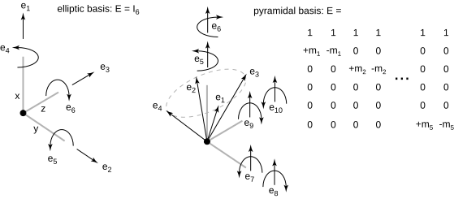

# MuJoCo 接触：建模、理论与计算

---
## 1 mujoco接触基本信息

MuJoCo 采用 **soft contact**（软接触）建模：接触不强制满足经典 LCP 的严格互补性。无摩擦时，其凸优化形式与 LCP 的 KKT 条件等价；有摩擦时，允许法向力与法向速度等分量出现小幅互补违反，这在软材料接触中更符合物理直觉，并有利于数值稳定。在建模上，接触与 equality、friction loss、limit 并列，都是约束系统中的一类约束。

每个活动接触会向全局约束数组写入若干标量行，分别对应 Jacobian（`mjData.efc_J`）、位置残差（`mjData.efc_pos`）和约束力（`mjData.efc_force`）。后续求解器对每一行独立评估状态并计算约束力。

单接触可产生的力/力矩分量维数由 **`condim`** 决定，记 \(n=\texttt{condim}\)。`condim=1` 为无摩擦法向接触；`condim=3` 在法向基础上增加两个切向摩擦分量；`condim=4` 进一步增加绕法向的扭转摩擦；`condim=6` 再增加两方向滚动摩擦，可抑制持续滚动。MuJoCo 不采用 `2` 或 `5`，因为切向与滚动摩擦按成对方向处理。

摩擦锥类型由全局 `<option cone="elliptic|pyramidal">` 选择，决定上述 \(n\) 维力向量需满足的锥约束，以及最终写入求解器的约束行数 \(nc\)。设摩擦系数向量为 \(\mu\)，官方给出两种摩擦锥定义：

$$
\text{elliptic cone}:\quad
\mathcal{K}=\left\{f\in\mathbb{R}^n:\ f_1\ge0,\ f_1^2\ge\sum_{i=2}^n \frac{f_i^2}{\mu_{i-1}^2}\right\}
$$

$$
\text{pyramidal cone}:\quad
\mathcal{K}=\left\{f\in\mathbb{R}^{2(n-1)}:\ f\ge0\right\}
$$

`elliptic` 对应二阶锥约束；`pyramidal` 对应非负变量锥（元素级不等式）。对于 pyramidal，维度从 \(n\) 展开为 \(2(n-1)\)，本质是在椭圆锥边界上用棱边基向量做线性近似。

结合两种摩擦锥，各 `condim` 取值对应的约束行数如下：

| condim | 物理含义 | elliptic 行数 \(nc\) | pyramidal 行数 \(nc\) |
|--------|----------|----------------------|------------------------|
| 1 | 仅法向 | 1 | 1 |
| 3 | 法向 + 2 切向 | 3 | 4 |
| 4 | + 扭转摩擦 | 4 | 6 |
| 6 | + 2 向滚动摩擦 | 6 | 10 |

因此，elliptic 约束行数 \(nc=n=\texttt{condim}\)；pyramidal 约束行数 \(nc=2(n-1)=2(\texttt{condim}-1)\)。

## 2 mujoco接触理论和计算细节

### 5) 接触对结果

- MuJoCo 的碰撞检测阶段会为每个候选接触对生成一个 `mjContact` 记录，供后续约束构建与求解使用。
- `dist`：两几何体沿接触法向的有符号距离。`dist > 0` 表示分离，`dist = 0` 表示刚好接触，`dist < 0` 表示穿透。
- `pos`：接触点位置（世界坐标），通常位于两接触表面沿法向的中间位置；后续 Jacobian 与约束都以该点为参考。
- `frame`：接触坐标系（3x3 旋转基，按行存储到 `mjContact.frame`）。其第 1 轴是法向方向，后两轴张成切向平面。
- `geom1/geom2`：参与接触的几何体 id；法向约定为从 `geom1` 指向 `geom2`，这会影响接触力方向与 Jacobian 符号。

### 5) 带摩擦的接触建模和计算，接触中间量计算， 雅克比矩阵Jacobian、位置级约束违约C、速度级约束违约Cdot

- 对单接触先构造 $S\in\mathbb{R}^{6\times n_v}$：将广义速度 $\dot q$ 映射为接触点的速度（表达在接触系下），平移块在上、转动块在下，$S=[S_p^\top,S_r^\top]^\top$,有${}^{\mathrm{c}}V_{\mathrm{rel}}=S\,\dot q$。
- 再由接触基矩阵 \(E\) 将接触力分量映射到空间力/力矩，接触 Jacobian 为：
  $$
  J_c=E^T S
  $$
- 该块 Jacobian 最终插入系统级 \(J\)（即 `efc_J`）参与整体求解。
- 位置级约束违约（记为 `C`），
  - frictionless：`C = dist`（1 行）；
  - pyramidal：每个棱边行都写 `C = dist`（每个摩擦维 2 行）；
  - elliptic：仅法向行写 `C = dist`，其余摩擦行不收嵌入深度影响，为C = 0。
- 速度级约束违约（记为 `Cdot`）由 Jacobian乘上广义速度直接得到。

### 6) 求解
在 求解的代价/状态评估中，
- `pyramidal`（以及 frictionless/limit）按“非负锥约束”处理：当 `jar >= 0` 时记为 `SATISFIED` 且该行约束力置 0；当 `jar < 0` 时进入 `QUADRATIC` 区并产生非零接触力。
- `elliptic` 接触按二阶锥分三段处理（top/bottom/middle zone）：。。。

## 无摩擦接触

### 1) 触发条件与核心流程

- 触发条件：`dim == 1`。
- 对第 `i` 个接触，先记录全局约束起始行：
  $$
  con->efc\_address = d->nefc
  $$
- 调用 `mj_contactJacobian(...)` 得到该接触影响的自由度数 $N_V$ 与相对雅可比差分。

若 $N_V=0$，则该接触不参与约束写入，代码会设置：
- `con->efc_address = -1`
- `con->exclude = 3`

### 2) 约束方程推导
mujoco在接触检测阶段给出：
接触几何对的距离dist，一般为负，表示相互嵌入，同时dist也是位置级约束违约
接触点pos，是最深嵌入线的中点，参考全局系表示，这里用p表示，而p0和p1表示该位置处，固定于body0和body1上的点
约束参考系$frame=A^(CT)$，其中$A^C$为接触坐标系（x轴表示geom0到geom1的方向的法向量），frame为其转置。

无摩擦接触约束方程为：
$$
A^CT (p_1-p_0) > -dist
A^CT (p_1-p_0) + dist > 0
$$
其中$(p_1-p_0)$表示p0到p1的向量（参考全局系）。
由于$A^CT$是正交矩阵，所以$A^CT (p_0-p_1)$表示p0到p1的向量在接触坐标系下的表示。

记接触前的相对空间雅可比为：
$$
S=
\begin{bmatrix}
S_p \\
S_r
\end{bmatrix},
\quad
S_p,S_r \in \mathbb{R}^{3\times N_V}
$$

将平动部分旋转到接触坐标系（`mju_mulMatMat`）：
$$
J_p = R\,S_p,\quad R=con->frame
$$

无摩擦仅使用法向行，记为 $j_0$。

### 3) 约束行生成公式

无摩擦接触只写入一行：
$$
J_c = j_0
$$
$$
pos = d,\quad margin = m_c
$$
其中 $d=con->dist,\ m_c=con->includemargin$。

对应调用参数可写为：
$$
\texttt{size}=1,\ \texttt{type}=\texttt{mjCNSTR\_CONTACT\_FRICTIONLESS}
$$

### 4) 与代码的对应

- `if (dim == 1)` 进入该分支。
- `mj_addConstraint(..., 1, mjCNSTR_CONTACT_FRICTIONLESS, ...)` 完成写入。
- 稀疏模式下仅写 `chain` 指定的 $N_V$ 个非零列；稠密模式下写整行。

## 棱锥摩擦锥

### 1) 触发条件与核心流程

- 触发条件：`dim > 1` 且 `ispyramid == 1`（全局 `cone="pyramidal"`）。
- 同样先得到 $N_V$，并在 $N_V=0$ 时跳过该接触。

### 2) 中间量与坐标变换

由 `mj_contactJacobian` 与旋转操作得到接触系候选行向量：
$$
\{j_0, j_1, \dots, j_{n-1}\}
$$
其中：
- $j_0$：法向行
- $j_k$：第 $k$ 个摩擦相关方向（$k=1,\dots,n-1$）
- $n=con->dim$

### 3) 约束行生成公式

对每个摩擦维 $k=1,\dots,n-1$，构造一对棱边行（对应两次 `mju_addScl`）：
$$
j_k^+ = j_0 + \mu_k j_k,\qquad
j_k^- = j_0 - \mu_k j_k
$$
其中 $\mu_k = con->friction[k-1]$。

每个 $k$ 追加 2 行，并共享：
$$
pos =
\begin{bmatrix}
d\\
d
\end{bmatrix},
\quad
margin =
\begin{bmatrix}
m_c\\
m_c
\end{bmatrix}
$$

故单接触总行数为：
$$
2(n-1)
$$

### 4) 与代码/理论的对应

- `for (int k=1; k < con->dim; k++)`：逐摩擦维展开棱边。
- `mj_addConstraint(..., 2, mjCNSTR_CONTACT_PYRAMIDAL, ...)`：每个 $k$ 写入 2 行。
- 与官方定义一致：pyramidal 单接触锥变量维度为 $2(n-1)$，并满足非负约束。

## 椭圆摩擦锥

### 1) 触发条件与核心流程

- 触发条件：`dim > 1` 且非 pyramidal（即 elliptic）。
- 同样先构造接触系行向量并判定 $N_V$。

### 2) 中间量与坐标变换

接触系行向量可记为：
$$
\{j_0, j_1, \dots, j_{n-1}\}
$$
并直接组成 $n$ 行约束块：
$$
J_c=
\begin{bmatrix}
j_0\\
j_1\\
\vdots\\
j_{n-1}
\end{bmatrix}
\in \mathbb{R}^{n\times N_V}
$$

### 3) 约束行生成公式

椭圆锥分支中，几何偏置只加在法向分量：
$$
pos_0=d,\quad margin_0=m_c
$$
$$
pos_i=0,\quad margin_i=0,\quad i=1,\dots,n-1
$$

对应一次性写入：
$$
\texttt{size}=n,\ \texttt{type}=\texttt{mjCNSTR\_CONTACT\_ELLIPTIC}
$$

### 4) 与代码/理论的对应

- 代码中先 `mju_zero(cpos, con->dim)`、`mju_zero(cmargin, con->dim)`，再设置 `cpos[0]` 和 `cmargin[0]`。
- `mj_addConstraint(..., con->dim, mjCNSTR_CONTACT_ELLIPTIC, ...)` 直接写入 $n$ 行。
- 与官方定义一致：elliptic 锥保留 $n$ 维力/力矩分量，满足二阶锥约束
  $$
  f_1 \ge 0,\quad
  f_1^2 \ge \sum_{i=2}^n \frac{f_i^2}{\mu_{i-1}^2}.
  $$

## 统一备注：`efc` 写入与索引

三类分支共用以下机制：

- 接触开始时保存 `con->efc_address = d->nefc`，作为全局约束向量起始索引。
- 每次 `mj_addConstraint` 都会把局部行块与 `pos/margin/type/id` 追加到 `efc`。
- 稠密模式复制完整雅可比行；稀疏模式仅复制 `chain` 指定列。

程序中一般分为3类分支：
- 无摩擦接触（frictionless），无论全局option设置为pyramidal还是elliptic，若设置dim=1，就只考虑法向接触，无摩擦
- 棱锥摩擦锥（pyramidal cone），若设置dim>1，且设置cone="pyramidal"，则为此情况
- 椭圆摩擦锥（elliptic cone），若设置dim>1，且设置cone="elliptic"，则为此情况
